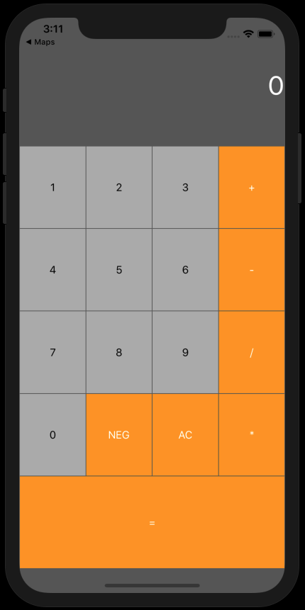

# Piscine-iOS-Swift

## Objectives
Boot Camp includes: 
Learning basic Swift Programming.
Building adaptive views with Auto-Layout. 
Call Data from APIs using URL requests.
Using and building Cocoapods. 
Making mapping solutions using MapKit.
Data Persistence using CoreData... 

## E.G.
 